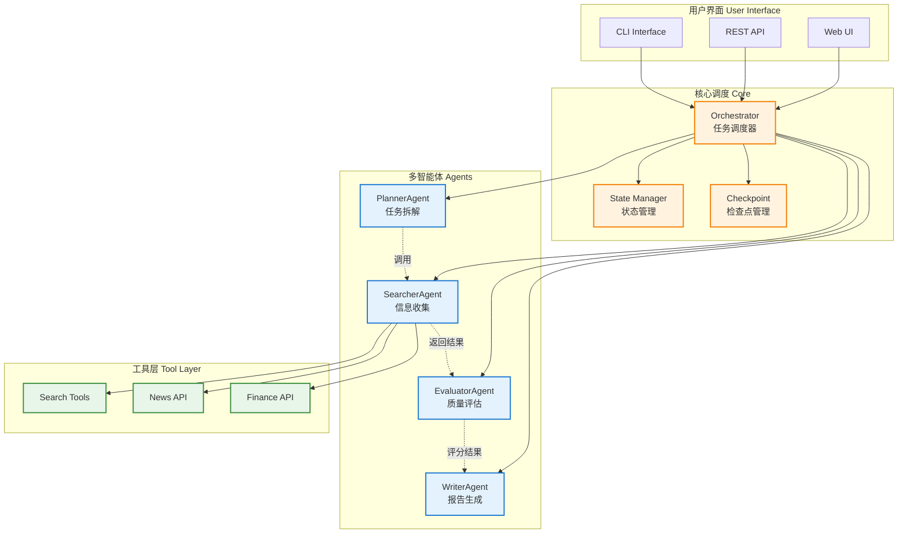
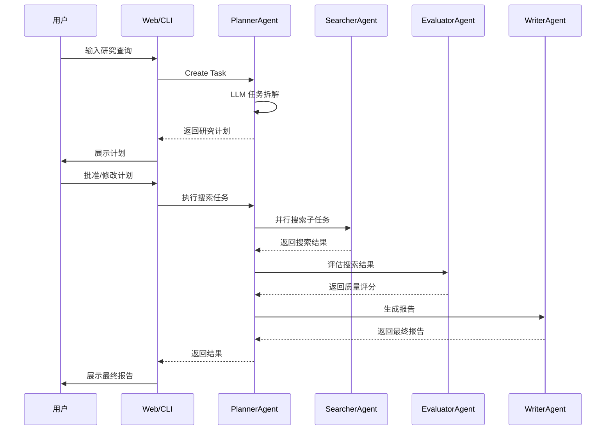
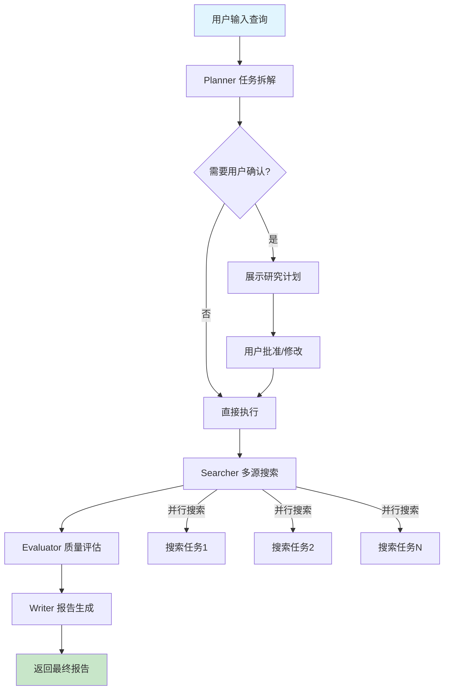

# Deep Research Agent

> 基于 LangGraph 的多智能体深度研究系统

**👨‍💻 作者**: Deep Research Agent Contributors
**项目维护者**: [@yyw1122](https://github.com/yyw1122)

- **GitHub**: [@yyw1122](https://github.com/yyw1122)
- **邮箱**: 1871283332@qq.com

**版本**: 1.0.0
**更新**: 2026-03-28

<p align="center">
  
  
  
  
</p>

## ✨ 项目简介

**Deep Research Agent** 是一个基于 LangGraph 框架构建的智能深度研究系统，灵感来源于字节跳动 DeerFlow 和 OpenAI Deep Research。该系统能够自动拆解复杂研究任务，通过多智能体协作完成信息收集、评估和报告生成。

### 核心特性

- 🤖 **多智能体协作**: Planner → Searcher → Evaluator → Writer 四阶段工作流
- 📊 **LangGraph 状态机**: 有状态图结构，支持检查点和任务恢复
- 🔄 **用户介入机制**: 计划确认、搜索干预、评估复核、报告审阅
- 📈 **实时进度追踪**: 流式输出进度百分比和各阶段状态
- 🎨 **现代化 Web UI**: 响应式设计，支持深色模式

## 🏗️ 系统架构

### 整体架构图



### 多智能体协作时序图



### 数据流说明

1. **Planner (规划Agent)**: 接收用户查询，使用 LLM 拆解为多个子任务，生成研究计划
2. **Searcher (搜索Agent)**: 根据计划中的关键词调用搜索工具，收集信息
3. **Evaluator (评估Agent)**: 对搜索结果进行质量评估、相关性评分、可靠性判断
4. **Writer (写作Agent)**: 整合评估后的信息，生成结构化研究报告

## 技术栈

| 组件 | 技术 |
|------|------|
| **LLM** | DeepSeek (支持 OpenAI 兼容 API) |
| **多智能体框架** | LangGraph + LangChain |
| **工作流编排** | LangGraph StateGraph |
| **Web 框架** | FastAPI + Uvicorn |
| **前端** | 原生 HTML/CSS/JS |
| **部署** | 本地运行 / Docker |

## 🛠️ 环境要求

### 前置条件

- **Python**: 3.10 或更高版本
- **pip**: 最新版本
- **Git**: 用于克隆项目

### 安装 Python 依赖

```bash
# 创建虚拟环境（推荐）
python -m venv venv
source venv/bin/activate  # Linux/Mac
# 或 Windows: venv\Scripts\activate

# 安装依赖
pip install -r requirements.txt
```

### 环境变量配置

复制 `.env.example` 为 `.env`，或直接创建并填入以下配置：

```bash
# ============================================
# Deep Research Agent 环境变量配置
# ============================================

# ====== DeepSeek LLM 配置 ======
# DeepSeek API 密钥（必填，用于智能任务拆解和报告生成）
DEEPSEEK_API_KEY=sk-your-api-key-here

# DeepSeek API 端点（使用默认或自建代理）
DEEPSEEK_BASE_URL=https://api.deepseek.com/v1

# 模型名称
DEEPSEEK_MODEL=deepseek-chat

# ====== 搜索工具配置 ======
# Tavily API 密钥（可选，用于增强搜索）
TAVILY_API_KEY=your-tavily-key

# ====== 新闻 API 配置 ======
# NewsAPI 密钥（可选，用于获取实时新闻）
NEWSAPI_KEY=your-newsapi-key

# ====== 应用配置 ======
# 调试模式
DEBUG=True

# 服务器地址
HOST=0.0.0.0
# 服务器端口
PORT=8000

# 检查点存储目录
CHECKPOINT_DIR=./checkpoints
```

> **注意**:
> - `DEEPSEEK_API_KEY` 是核心配置，强烈建议配置以启用智能分析功能
> - 其他 API 密钥为可选配置，不配置时系统会使用内置的模拟数据
> - 配置文件支持从环境变量读取，也可直接写入 `.env` 文件


## 🚀 快速开始

### 方式一：命令行快速体验

```bash
# 直接执行一个研究任务（无需配置 API Key，使用内置模拟数据）
python main.py --query "什么是碳中和"

# 启用 DeepSeek LLM 智能分析（需要配置 API Key）
python main.py --query "2026年新能源汽车市场趋势分析"
```

**运行效果示例：**

```
============================================================
研究报告: 什么是碳中和研究报告
============================================================

摘要: 碳中和是指通过节能减排、能源替代等方式，使CO2排放量与吸收量相平衡...
质量评分: 0.85
```

### 方式二：Web 界面

```bash
# 启动 Web 服务
python main.py web
```

然后在浏览器打开 **http://localhost:8000**

> **Web 界面预览**: 包含搜索输入框、实时进度条、研究计划展示、报告预览、任务历史列表等功能

### 方式三：REST API

```bash
# 创建研究任务
curl -X POST http://localhost:8000/api/research \
  -H "Content-Type: application/json" \
  -d '{"query": "人工智能发展趋势", "enable_llm": true}'

# 查看任务状态
curl http://localhost:8000/api/research/{task_id}
```

### 方式四：交互式 CLI

```bash
# 启动交互式命令行
python main.py cli

# 输入研究主题，如：什么是碳中和
# 系统会自动执行完整的四阶段研究流程
```

## 项目结构

```
deep_research_agent/
├── agents/                    # 智能体实现
│   ├── base.py              # 智能体基类
│   ├── planner.py           # 规划智能体 - 任务拆解
│   ├── searcher.py          # 搜索智能体 - 信息收集
│   ├── evaluator.py         # 评估智能体 - 质量评估
│   └── writer.py            # 写作智能体 - 报告生成
├── tools/                    # 工具层
│   ├── search.py            # 搜索工具 (Tavily, DuckDuckGo)
│   ├── news.py              # 新闻工具
│   └── finance.py           # 金融数据工具
├── core/                     # 核心组件
│   ├── orchestrator.py     # 任务调度器 - 负责任务流程控制、智能体协调、回调处理
│   ├── state.py            # 状态管理 - 研究状态数据结构
│   ├── checkpoint.py       # 检查点管理 - 任务持久化与恢复
│   └── schema.py            # 数据模型 - Pydantic 数据结构定义
├── workflow/                 # LangGraph 工作流
│   └── research_graph.py   # 状态图定义 - LangGraph StateGraph 编排
├── ui/                       # 用户界面
│   ├── web.py              # FastAPI Web 界面
│   └── cli.py              # CLI 界面
└── config/
    └── settings.py         # 配置管理
```

### 目录职责说明

| 目录 | 职责 | 主要职责 |
|------|------|----------|
| `core/` | 核心运行时 | 任务调度、状态管理、持久化 |
| `workflow/` | 工作流定义 | LangGraph 图结构、节点定义 |
| `agents/` | 智能体实现 | 业务逻辑、工具调用 |
| `tools/` | 工具层 | 外部 API 封装、搜索/新闻/金融 |

> **注意**: `core/orchestrator.py` 负责整体任务调度和流程控制，`workflow/research_graph.py` 定义 LangGraph 状态图结构，两者配合实现有状态工作流。

## 智能体详解

| 智能体 | 职责 | 核心能力 |
|--------|------|----------|
| **PlannerAgent** | 任务拆解 | 分析用户意图、生成研究计划、任务排序 |
| **SearcherAgent** | 信息收集 | 多源搜索、关键词提取、信息去重 |
| **EvaluatorAgent** | 质量评估 | 相关性评分、可靠性判断、来源分类 |
| **WriterAgent** | 报告生成 | 内容整合、大纲规划、多格式导出 |

### 工作流执行流程



**执行顺序说明：**
1. **Planner** 接收用户查询，调用 LLM 拆解为多个子任务
2. **Searcher** 并行执行各子任务的搜索，收集信息
3. **Evaluator** 对搜索结果进行质量评估和相关性排序
4. **Writer** 整合评估后的信息，生成结构化报告

## 进阶功能

### 用户介入点

```
介入点设计:
1. 计划确认点 ─→ 用户审核/修改研究计划
2. 搜索干预点 ─→ 用户添加/排除关键词
3. 评估复核点 ─→ 用户确认关键发现
4. 报告审阅点 ─→ 用户修改/补充内容
```

### 检查点机制

- 自动保存任务状态到本地
- 支持任务中断后恢复
- 7天后自动清理旧检查点

### 错误处理

- 搜索失败自动切换备用提供者
- LLM 调用失败回退到规则引擎
- 完整错误日志记录

## 配置说明

```env
# DeepSeek 配置
DEEPSEEK_API_KEY=sk-xxx
DEEPSEEK_BASE_URL=https://api.deepseek.com/v1
DEEPSEEK_MODEL=deepseek-chat

# 搜索工具配置
TAVILY_API_KEY=your_tavily_key

# 新闻 API 配置
NEWSAPI_KEY=your_newsapi_key
```

## 示例输出

```
============================================================
研究报告: 2026年人形机器人产业链上下游机会研究报告
============================================================

摘要: 本研究报告针对"2026年人形机器人产业链上下游机会"进行全面研究...
主要发现:
- 上游核心零部件包括减速器、传感器、控制器等
- 下游应用场景涵盖工业制造、服务业、医疗健康等领域
- 预计2026年市场规模将突破百亿...
...
质量评分: 0.85
```

## 性能指标

- 单任务执行时间: ~10-30秒 (取决于搜索复杂度)
- LLM 调用: 约 2-3 次/任务 (Planner拆解 + Writer生成报告)
- 最大搜索结果: 50条/任务
- 最大子任务数: 20个/任务

## 贡献指南

欢迎贡献代码！请遵循以下步骤：

### 开发环境设置

```bash
# 1. Fork 本仓库
# 2. 克隆你的 Fork
git clone https://github.com/YOUR_USERNAME/MyNewProject.git
cd MyNewProject

# 3. 创建开发分支
git checkout -b feature/your-feature-name

# 4. 安装开发依赖（包含测试框架）
pip install -r requirements.txt
pip install pytest pytest-asyncio black flake8 mypy
```

### 代码规范

- **Python**: 遵循 PEP 8，使用 `black` 格式化
- **类型注解**: 使用 type hints，使用 `mypy` 检查
- **命名**: 英文命名，清晰表达意图
- **注释**: 复杂逻辑添加中文注释

### 提交规范

```bash
# 提交时使用有意义的描述
git commit -m "feat: 添加新的搜索提供者

- 新增 TavilySearchProvider
- 实现搜索重试机制
- 添加单元测试"

# 推送到你的 Fork
git push origin feature/your-feature-name
```

### Pull Request 流程

1. **创建功能分支**: `feature/xxx` 或 `fix/xxx`
2. **编写代码**: 包含必要的测试
3. **提交 PR**: 描述改动内容和原因
4. **代码审查**: 等待维护者审核
5. **合并**: 审核通过后合并

### 常见贡献类型

| 类型 | 说明 |
|------|------|
| `feat` | 新功能 |
| `fix` | Bug 修复 |
| `docs` | 文档更新 |
| `refactor` | 代码重构 |
| `test` | 测试相关 |

### 测试

```bash
# 运行单元测试
pytest tests/

# 运行特定测试
pytest tests/agents/test_planner.py -v
```

## 许可证

本项目基于 MIT 许可证开源，详见 [LICENSE](LICENSE) 文件。

```
MIT License

Copyright (c) 2026 Deep Research Agent Contributors

Permission is hereby granted, free of charge, to any person obtaining a copy
of this software and associated documentation files (the "Software"), to deal
in the Software without restriction, including without limitation the rights
to use, copy, modify, merge, publish, distribute, sublicense, and/or sell
copies of the Software, and to permit persons to whom the Software is
furnished to do so, subject to the following conditions:

The above copyright notice and this permission notice shall be included in all
copies or substantial portions of the Software.

THE SOFTWARE IS PROVIDED "AS IS", WITHOUT WARRANTY OF ANY KIND, EXPRESS OR
IMPLIED, INCLUDING BUT NOT LIMITED TO THE WARRANTIES OF MERCHANTABILITY,
FITNESS FOR A PARTICULAR PURPOSE AND NONINFRINGEMENT. IN NO EVENT SHALL THE
AUTHORS OR COPYRIGHT HOLDERS BE LIABLE FOR ANY CLAIM, DAMAGES OR OTHER
LIABILITY, WHETHER IN AN ACTION OF CONTRACT, TORT OR OTHERWISE, ARISING FROM,
OUT OF OR IN CONNECTION WITH THE SOFTWARE OR THE USE OR OTHER DEALINGS IN THE
SOFTWARE.
```