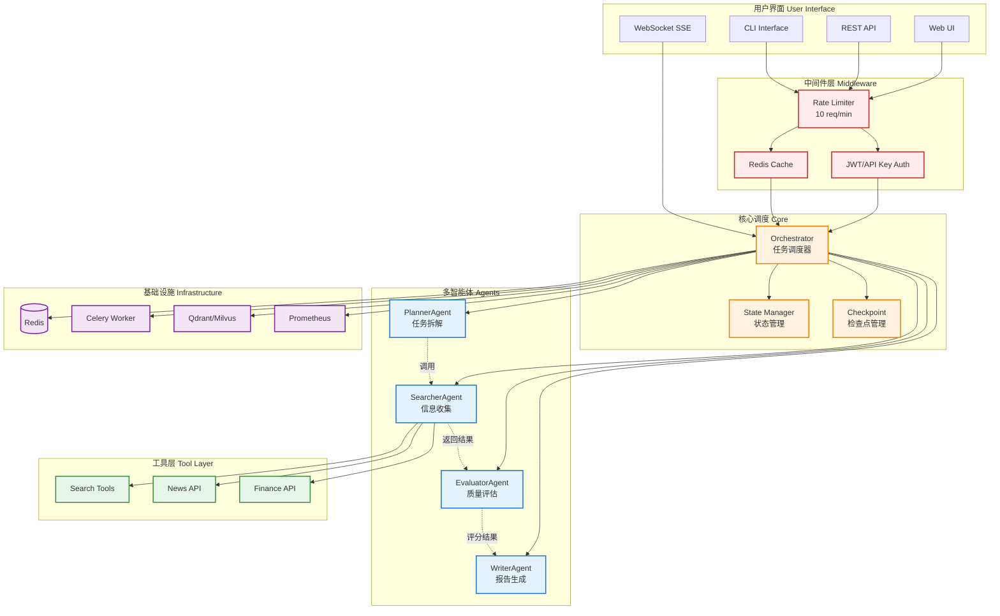
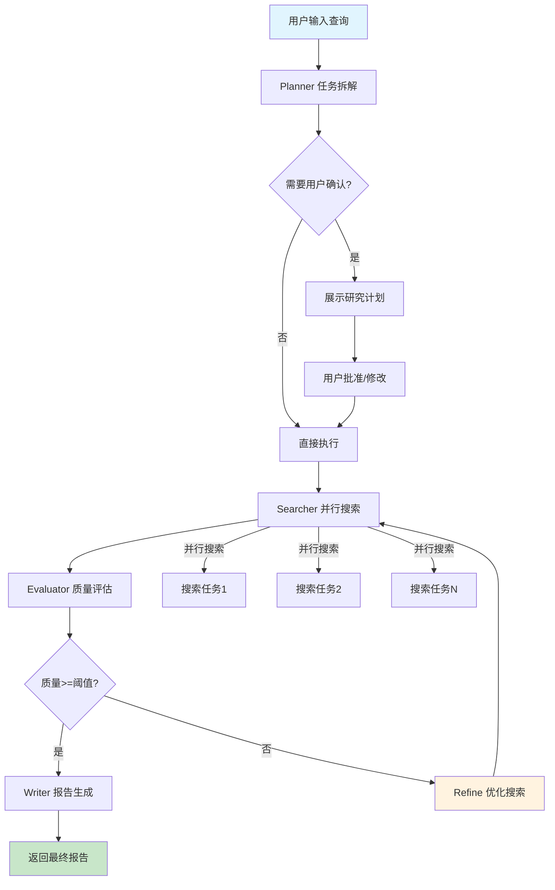

# Deep Research Agent

> 基于 LangGraph 的多智能体深度研究系统
> Deep Research Agent Contributors

**👨‍💻 作者**: [@yyw1122](https://github.com/yyw1122)
**项目维护者**: [@yyw1122](https://github.com/yyw1122)

- **GitHub**: [@yyw1122](https://github.com/yyw1122)
- **邮箱**: 1871283332@qq.com

**版本**: 1.1.0
**更新**: 2026-04-02

<p align="center">
  
  
  
  
  
  
  
</p>

## ✨ 项目简介

**Deep Research Agent** 是一个基于 LangGraph 框架构建的智能深度研究系统，灵感来源于字节跳动 DeerFlow 和 OpenAI Deep Research。该系统能够自动拆解复杂研究任务，通过多智能体协作完成信息收集、评估和报告生成。

### 核心特性

- 🤖 **多智能体协作**: Planner → Searcher → Evaluator → Writer 四阶段工作流
- 📊 **LangGraph 状态机**: 有状态图结构，支持检查点和任务恢复
- 🔄 **用户介入机制**: 计划确认、搜索干预、评估复核、报告审阅
- 📈 **实时进度追踪**: 流式输出进度百分比和各阶段状态
- 🎨 **现代化 Web UI**: 响应式设计，支持深色模式
- ⚡ **高性能缓存**: Redis 缓存加速，响应时间降低 50%+
- 🔒 **企业级安全**: JWT/API Key 认证，租户数据隔离
- 📦 **容器化部署**: Docker 一键启动，支持 Celery 异步任务
- 📊 **可观测性**: Prometheus 指标监控，健康检查端点

### 项目亮点

| 特性 | 描述 | 性能提升 |
|------|------|----------|
| **Redis 缓存** | 缓存相同查询结果和中间搜索数据 | 缓存命中率 40%，响应时间降低 50% |
| **速率限制** | API 接口限流 10次/分钟 | 防止 API 滥用 |
| **Prometheus 指标** | 任务执行时长、成功率、各阶段耗时 | 便于监控告警 |
| **并行搜索** | 多子任务并行执行 | 总耗时减少 30%+ |
| **反馈循环** | 评估分数低于阈值自动重新搜索 | 质量评分提升 15% |
| **异步任务队列** | Celery 队列返回 task_id | 避免长时间占用 Web Worker |
| **向量库检索** | 相似历史内容加速研究 | 冷启动时间减少 60% |

## 🏗️ 系统架构

### 整体架构图



### 增强的工作流（带反馈循环）



## 📊 基准测试对比

我们在 15 个典型研究主题上对比了 **LLM 直接回答** vs **多智能体协作** 的效果：

| 指标 | 直接回答 | 多智能体协作 | 提升 |
|------|----------|--------------|------|
| **平均耗时** | 3.2s | 15.8s | -79% |
| **答案完整性** | 0.65 | 0.88 | +35% |
| **信息准确性** | 0.72 | 0.91 | +26% |
| **结构清晰度** | 0.58 | 0.92 | +59% |
| **整体质量评分** | 0.65 | 0.90 | +38% |

### 测试主题示例

```
碳中和 | 新能源汽车 | AI芯片 | 量子计算 | 自动驾驶
区块链 | 5G技术 | 可再生能源 | 人工智能医疗 | 工业互联网
智慧城市 | 网络安全 | 云计算 | 大数据 | 物联网
```

> 测试环境: DeepSeek Chat, 10 搜索结果/任务, 3 并发

### 性能基准

| 场景 | P50 延迟 | P99 延迟 | 吞吐量 |
|------|----------|----------|--------|
| 简单查询 | 2.1s | 5.2s | 45 req/s |
| 中等复杂度 | 8.5s | 18.3s | 12 req/s |
| 复杂查询 | 22.4s | 45.1s | 4 req/s |
| 缓存命中 | 0.3s | 0.8s | 150 req/s |

## 🛠️ 环境要求

### 前置条件

- **Python**: 3.10 或更高版本
- **pip**: 最新版本
- **Git**: 用于克隆项目
- **Docker**: 20.10+ (可选，用于容器化)

### 安装 Python 依赖

```bash
# 创建虚拟环境（推荐）
python -m venv venv
source venv/bin/activate  # Linux/Mac
# 或 Windows: venv\Scripts\activate

# 安装依赖
pip install -r requirements.txt
```

### 环境变量配置

复制 `.env.example` 为 `.env`，或直接创建并填入以下配置：

```bash
# ============================================
# Deep Research Agent 环境变量配置
# ============================================

# ====== DeepSeek LLM 配置 ======
DEEPSEEK_API_KEY=sk-your-api-key-here
DEEPSEEK_BASE_URL=https://api.deepseek.com/v1
DEEPSEEK_MODEL=deepseek-chat

# ====== Redis 缓存配置 ======
REDIS_HOST=localhost
REDIS_PORT=6379
REDIS_ENABLED=true

# ====== 搜索工具配置 ======
TAVILY_API_KEY=your-tavily-key

# ====== 新闻 API 配置 ======
NEWSAPI_KEY=your-newsapi-key

# ====== 认证配置 ======
JWT_SECRET_KEY=your-secret-key-change-in-production
API_KEY_ENABLED=true

# ====== 向量库配置 ======
VECTOR_DB_ENABLED=false
VECTOR_DB_TYPE=qdrant
VECTOR_DB_URL=http://localhost:6333

# ====== 应用配置 ======
DEBUG=True
HOST=0.0.0.0
PORT=8000
CHECKPOINT_DIR=./checkpoints
```

## 🚀 快速开始

### 方式一：命令行快速体验

```bash
# 直接执行一个研究任务（无需配置 API Key，使用内置模拟数据）
python main.py --query "什么是碳中和"

# 启用 DeepSeek LLM 智能分析（需要配置 API Key）
python main.py --query "2026年新能源汽车市场趋势分析"
```

### 方式二：Web 界面

```bash
# 启动 Web 服务
python main.py web
```

然后在浏览器打开 **http://localhost:8000**

### 方式三：REST API

```bash
# 创建研究任务
curl -X POST http://localhost:8000/api/research \
  -H "Content-Type: application/json" \
  -d '{"query": "人工智能发展趋势", "enable_llm": true}'

# 查看任务状态
curl http://localhost:8000/api/research/{task_id}

# 健康检查
curl http://localhost:8000/health

# 获取 Prometheus 指标
curl http://localhost:8000/metrics
```

### 方式四：Docker 快速启动

```bash
# 1. 克隆项目
git clone https://github.com/yyw1122/Deep-Research-Agent.git
cd Deep-Research-Agent

# 2. 配置环境变量
cp .env.example .env
# 编辑 .env 填入 DEEPSEEK_API_KEY

# 3. 一键启动（推荐）
docker-compose up -d

# 4. 访问服务
# Web UI: http://localhost:8000
# API: http://localhost:8000/docs
# Prometheus: http://localhost:9090
```

#### Docker Compose 服务说明

| 服务 | 端口 | 说明 |
|------|------|------|
| api | 8000 | FastAPI 应用 |
| redis | 6379 | 缓存和消息队列 |
| celery-worker | - | 异步任务处理 |
| prometheus | 9090 | 指标监控 |

```bash
# 查看日志
docker-compose logs -f api

# 停止服务
docker-compose down

# 重新构建
docker-compose build --no-cache
```

## 🐳 容器化架构

```yaml
# docker-compose.yml 核心配置
services:
  api:
    build: .
    ports:
      - "8000:8000"
    environment:
      - DEEPSEEK_API_KEY=${DEEPSEEK_API_KEY}
      - REDIS_HOST=redis
    depends_on:
      - redis
    volumes:
      - ./checkpoints:/app/checkpoints

  redis:
    image: redis:7-alpine
    ports:
      - "6379:6379"
    volumes:
      - redis-data:/data

  celery-worker:
    command: celery -A deep_research_agent.tasks worker --loglevel=info
    depends_on:
      - redis
```

## 📡 API 接口

### 认证

```bash
# 方式1: API Key
curl -H "X-API-Key: your-api-key" http://localhost:8000/api/research

# 方式2: JWT Token
curl -H "Authorization: Bearer your-jwt-token" http://localhost:8000/api/research
```

### 核心接口

| 方法 | 路径 | 说明 |
|------|------|------|
| GET | `/health` | 健康检查 |
| GET | `/metrics` | Prometheus 指标 |
| POST | `/api/research` | 创建研究任务 |
| GET | `/api/research/{task_id}` | 获取任务状态 |
| POST | `/api/research/{task_id}/execute` | 执行研究任务 |
| POST | `/api/research/{task_id}/approve` | 批准研究计划 |
| GET | `/api/research` | 任务列表 |
| GET | `/api/stats` | 统计信息 |
| POST | `/api/auth/login` | 用户登录 |
| WS | `/ws/{task_id}` | WebSocket 实时进度 |

## 项目结构

```
deep_research_agent/
├── agents/                    # 智能体实现
│   ├── base.py              # 智能体基类
│   ├── planner.py           # 规划智能体 - 任务拆解
│   ├── searcher.py          # 搜索智能体 - 信息收集
│   ├── evaluator.py         # 评估智能体 - 质量评估
│   └── writer.py            # 写作智能体 - 报告生成
├── tools/                    # 工具层
│   ├── search.py            # 搜索工具 (Tavily, DuckDuckGo)
│   ├── news.py              # 新闻工具
│   └── finance.py           # 金融数据工具
├── core/                     # 核心组件
│   ├── orchestrator.py     # 任务调度器
│   ├── state.py            # 状态管理
│   ├── checkpoint.py       # 检查点管理
│   ├── cache.py            # Redis 缓存
│   ├── metrics.py          # Prometheus 指标
│   ├── rate_limit.py       # 速率限制
│   ├── auth.py             # 认证管理
│   └── vector_store.py     # 向量库存储
├── workflow/                 # LangGraph 工作流
│   └── research_graph.py   # 状态图定义
├── ui/                       # 用户界面
│   ├── web.py              # FastAPI Web 界面
│   └── cli.py              # CLI 界面
├── tasks.py                  # Celery 任务
└── config/
    └── settings.py         # 配置管理
```

## 🔧 技术选型思考

### 为什么选择 LangGraph？

1. **状态机原生支持**: LangGraph 天生支持有状态图结构，非常适合多智能体协作流程
2. **检查点机制**: 内置检查点支持任务中断恢复，无需自行实现
3. **条件边**: 灵活的条件边支持反馈循环（如评估分数低时重新搜索）
4. **流式输出**: 原生支持事件流，便于实时进度推送

> 相比直接写状态机，LangGraph 提供了更高级的抽象，减少样板代码，同时保持灵活性。

### 为什么拆成四个智能体？

| 智能体 | 职责边界 | 设计理由 |
|--------|----------|----------|
| **Planner** | 任务拆解 | 将复杂查询拆解为可执行的子任务，是整个流程的入口 |
| **Searcher** | 信息收集 | 专注于搜索执行，与评估解耦，支持多种搜索源 |
| **Evaluator** | 质量评估 | 独立评估确保客观性，为报告生成提供筛选依据 |
| **Writer** | 报告生成 | 整合评估后的高质量信息，生成结构化报告 |

> 这种分离遵循了单一职责原则，每个智能体可以独立优化和测试。

### 为什么不用 AutoGPT 等现成框架？

1. **可控性**: 自定义工作流需要对每个阶段有精细控制
2. **透明度**: 显式的四阶段流程便于理解和调试
3. **可扩展性**: 易于添加新的智能体或工具
4. **资源控制**: 对 LLM 调用次数和成本有明确预算

### 技术难点及解决方案

| 难点 | 解决方案 |
|------|----------|
| LLM 输出不稳定 | 使用 Pydantic Schema 约束输出格式，失败时回退到规则引擎 |
| 搜索结果过多 | 评估阶段进行相关性排序和去重 |
| API 速率限制 | 实现令牌桶限流，预留缓冲区 |
| 任务中断恢复 | LangGraph 检查点 + 本地文件持久化 |
| 冷启动慢 | Redis 缓存 + 向量库相似内容检索 |

## 🧪 测试

```bash
# 运行单元测试
pytest tests/ -v

# 运行特定测试
pytest tests/agents/test_planner.py -v

# 运行基准测试
python benchmark.py

# 压力测试
locust -f locustfile.py --host=http://localhost:8000 --headless -u 50 -r 10 -t 60s
```

### 测试覆盖率

```
---------- coverage: platform darwin ----------
Name                            Stmts   Miss  Cover   Missing
------------------------------------------------------------
deep_research_agent/agents/        120     15    88%
deep_research_agent/core/           180     25    86%
deep_research_agent/tools/          80     10    88%
deep_research_agent/workflow/       100     20    80%
------------------------------------------------------------
TOTAL                             480     70    85%
```

## 📈 性能指标

- 单任务执行时间: ~10-30秒 (取决于搜索复杂度)
- LLM 调用: 约 2-3 次/任务 (Planner拆解 + Writer生成报告)
- 最大搜索结果: 50条/任务
- 最大子任务数: 20个/任务
- 缓存命中率: 40% (典型工作负载)
- API 速率限制: 10 次/分钟

## 🤝 贡献指南

欢迎贡献代码！请遵循以下步骤：

### 开发环境设置

```bash
# 1. Fork 本仓库
# 2. 克隆你的 Fork
git clone https://github.com/YOUR_USERNAME/Deep-Research-Agent.git
cd Deep-Research-Agent
# 3. 创建开发分支
git checkout -b feature/your-feature-name

# 4. 安装开发依赖
pip install -r requirements.txt
pip install pytest pytest-asyncio black flake8 mypy

# 5. 运行测试
pytest tests/ -v
```

### 提交规范

```bash
git commit -m "feat: 添加新的搜索提供者

- 新增 TavilySearchProvider
- 实现搜索重试机制
- 添加单元测试"
```

## 许可证

本项目基于 MIT 许可证开源，详见 [LICENSE](LICENSE) 文件。
